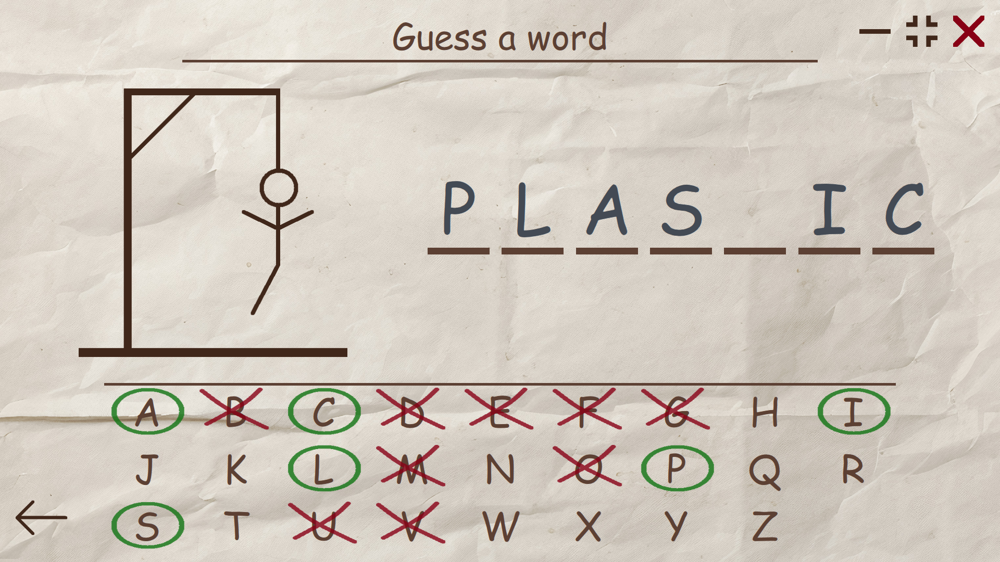

# Hangman_Game_Qt

Desktop Hangman game made with C++/Qt/QML.   

Hangman is a word guessing game. Program randomly chooses a word and the player tries to guess it by suggesting letters. Which each incorrect guess, a line is added to hangman drawing. If the picture is complete, player loses. To win, player has to correctly guess all letters in a word.

## Features

* Words to guess are chosen randomly from a file. 
* Application supports dynamic translations. 
* Currently, the game is available in English and Russian. 
* More than 1500 English words and 1000 Russian words. 
* Fullscreen and Windowed modes. 

## Screenshots

