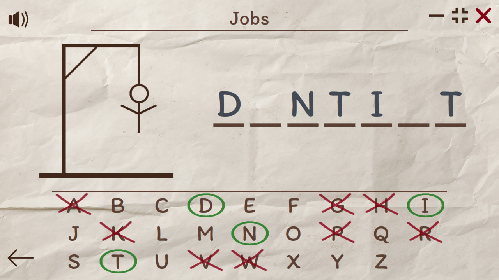
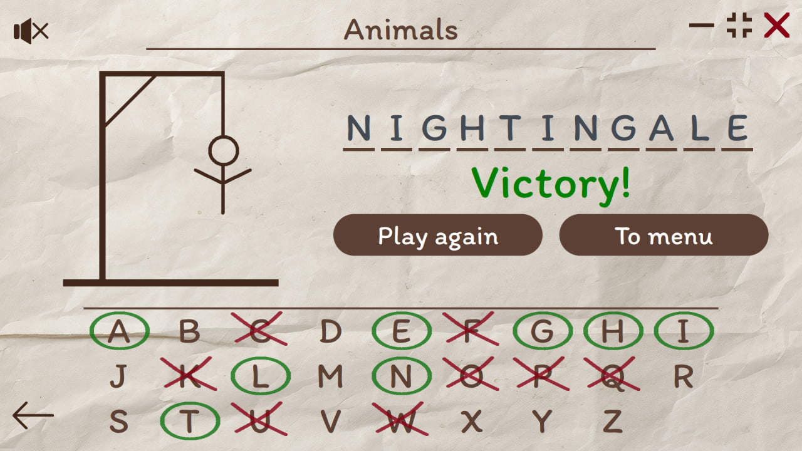
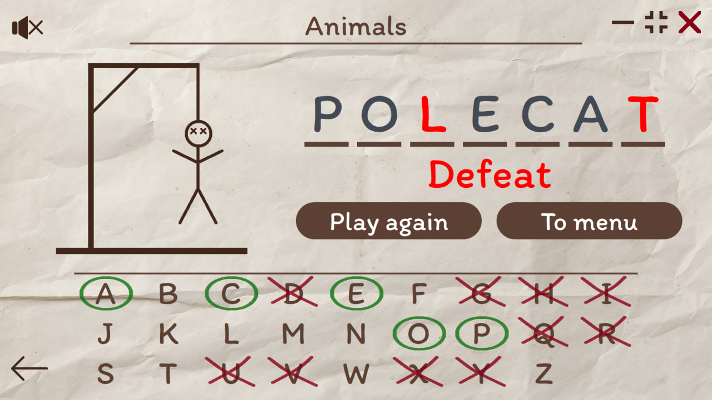

# Hangman_Game_Qt

[](https://github.com/Dariarty/Hangman_Game_Qt/blob/main/README.md)
[](https://github.com/Dariarty/Hangman_Game_Qt/blob/main/README.ru.md)

Hangman game made with C++/Qt/QML. </br> 

Hangman is a word guessing game. Program randomly chooses a word and the player tries to guess it by suggesting letters. With each incorrect guess, a line is added to hangman drawing. If the picture is complete, player loses. To win, player has to correctly guess all letters in a word.

## Features

* Lots of gamemodes for words on different themes and topics.</br>
* More than 2500 English and 2000 Russian words.</br>
* 15 English and 15 Russian topics. Topics can be shuffled and chosen randomly.</br>
* Words to guess are chosen randomly from files. </br>
* Sound effects when interacting with game's GUI.</br>
* Fullscreen and Windowed modes, app is responsive to different window sizes.</br>
* Application supports dynamic translations.</br>
* Currently, the game is available in English and Russian.</br>

## Screenshots

<h3 align="center">Gameplay</h3>



<h3 align="center">Main Menu of the application</h3>


<h3 align="center">Player has successfully guessed a word</h3>



<h3 align="center">Player has failed to guess a word</h3>




## Building Source Code
App currently supports building for Windows, Linux and WebAssembly (using Qt for WebAssembly). </br>
Minimal supported Qt version is Qt 5.10. Maximum tested Qt version for building the app is Qt 6.7.2 </br>
1.  Download and install Qt5.10+/Qt6, Qt Creator and MinGW compiler.</br>
2.  Configure Qt Creator Kit for Desktop or Qt for WebAssembly Kit. </br>
3.  Clone the repo.
     ```sh
     git clone https://github.com/Dariarty/Hangman_Game_Qt.git
     ```
4.  Open src/hangman_game.pro in Qt Creator.</br>
5.  Run lrelease tool to read the TS files and produce the QM translation files. </br>
    Qt Creator > Tools > External > Linguist > Release Translations (lrelease) </br>
7.  Run qmake.</br>
8.  Build the project in Qt Creator.</br>

## Attributions

Application Icon is designed by [Freepik](https://freepik.com)

## License

Distributed under the MIT License. See [LICENSE](LICENSE) for more information.


