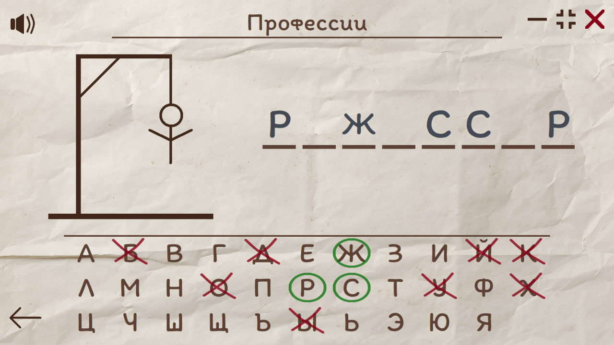
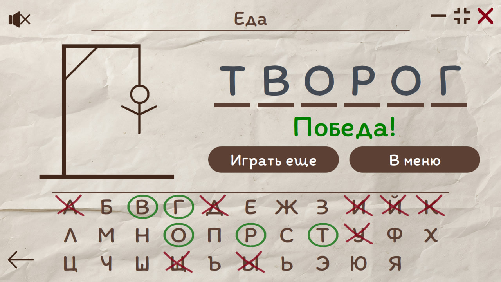
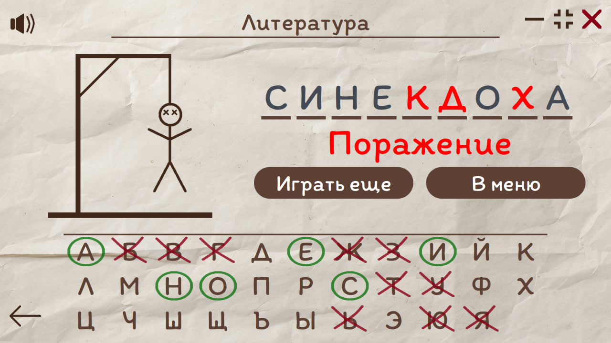

# Hangman_Game_Qt

[](https://github.com/Dariarty/Hangman_Game_Qt/blob/main/README.md)
[](https://github.com/Dariarty/Hangman_Game_Qt/blob/main/README.ru.md)

Кроссплатформенная игра "Виселица", написанная на C++/Qt/QML. </br> 

Виселица - это игра на угадывание слов. Программа случайным образом выбирает слово, которое должен угадать игрок. Изначально известно количество букв, и каждая буква обозначается чертой. С каждым ходом игрок предлагает букву, если она есть в слове - эта буква открывается, если нет - к рисунку виселицы добавляется черта. Если рисунок повешенного человечка завершен, игрок проигрывает. Для победы надо назвать все буквы в слове. 

## Функции приложения

* Множество игровых режимов со словами на разные темы.</br>
* Более 2000 русских и 2500 английских слов для игры.</br>
* 15 русских и английских тем, которые можно перемешать и выбрать случайную.</br>
* Выбор случайного слова для игры из файла.</br>
* Звуковые эффекты во время геймплея.</br>
* Полноэкранный и оконный режимы, поддержка разных размеров окна.</br>
* Поддержка динамического перевода.</br>
* На данный момент, приложение доступно на русском и английском языках.</br>

## Скриншоты

<h3 align="center">Игровой процесс</h3>



<h3 align="center">Главное меню приложения</h3>


<h3 align="center">Игрок успешно угадал слово</h3>



<h3 align="center">Игрок не смог угадать слово</h3>



## Сборка исходного кода
На данный момент поддерживается сборка на Windows, Linux и WebAssembly (с использованием Qt for WebAssembly).</br>
Минимальная поддерживаемая версия Qt 5.10. Также приложение может быть собрано на Qt6, протестирована сборка на Qt 6.7.2 </br>

1.  Загрузить Qt5.10+/Qt6, Qt Creator и компилятор MinGW.</br>
2.  Сконфигурировать Desktop Kit в Qt Creator. </br>
3.  Склонировать репозиторий
     ```sh
     git clone https://github.com/Dariarty/Hangman_Game_Qt.git
     ```
4.  Открыть файл проекта src/hangman_game.pro в Qt Creator</br>
5.  Запустить команду lrelease для чтения файлов TS и генерации файлов перевода QM. </br>
    Qt Creator > Tools > External > Linguist > Release Translations (lrelease) </br>
6.  Запустить qmake.</br>
7.  Собрать проект в Qt Creator.</br>

## Атрибуция

Иконка приложения создана [Freepik](https://freepik.com)

## Лицензия

Распространяется под MIT License. Смотри [LICENSE](LICENSE) для полной информации.
